# 🛡️ Wazuh File Integrity Monitoring (FIM) – Windows Agent Project

This project demonstrates hands-on implementation of File Integrity Monitoring (FIM) using Wazuh SIEM on a Windows endpoint to detect unauthorized file and registry changes. I configured a Wazuh agent on a local Microsoft Windows system homelab to monitor the **`C:\Users\Public`** directory for **file creation**, **modification**, and **deletion events**, a common target for attacker tool staging and persistence.

The solution aligns with **`PCI DSS`** and **`NIST 800-53`** compliance requirements and includes custom FIM and Windows Registry monitoring rules to detect persistence techniques mapped to **`MITRE ATT&CK T1547.01`** (Registry Run Keys / Startup Folder). The configuration leverages real-time monitoring **`(whodata)`** to capture user attribution, process execution context, and file change metadata.

All alerts were validated through the `Wazuh Web Interface` (SIEM dashboard) on a local Linux Wazuh server, confirming end-to-end visibility from endpoint agents to security alert generation.

⚠️ Prerequisite: This project assumes a functional Wazuh SIEM server and a properly enrolled Windows endpoint agent.

---

## 📦 What This Project Covers

- Configure Wazuh File Integrity Monitoring (FIM) on a Windows agent

- Monitor sensitive directories for unauthorized file changes

- Validate real-time alerts through the Wazuh Dashboard
---

## 🚀 How to Run

### 1️⃣ Verify the Wazuh agent is running on Windows
On the Windows endpoint, open Powershell/Terminal as Administrator:
```bash
Get-Service Wazuh
```


You should see:
```bash
Status   Name    DisplayName
------   ----    -----------
Running  Wazuh   Wazuh Agent
```
If not running:
```bash
Start-Service Wazuh
```
---
### 2️⃣ Locate the Windows agent configuration file
By default on Windows, the Wazuh agent lives here:
```bash
C:\Program Files (x86)\ossec-agent\ossec.conf
```
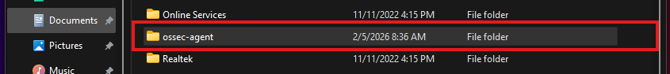

Then inside the folder:

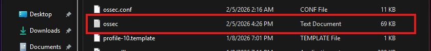

---
### 3️⃣ Backup the configuration 
### ⚠️ Highly Recommended
```bash
Copy-Item `
"C:\Program Files (x86)\ossec-agent\ossec.conf" `
"C:\Program Files (x86)\ossec-agent\ossec.conf.bak"
```
---
### 4️⃣ Find and open Wazuh FIM module `ossec.conf`
Open Notepad or preferred text editor as Administrator, then open:
```bash
C:\Program Files (x86)\ossec-agent\ossec.conf
```
We're looking for the `<syscheck>` section near `File intergrity monitoring`.
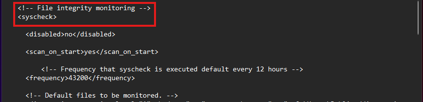

---
### 5️⃣ Edit the Wazuh FIM module `ossec.conf`
- By default FIM is enabled in the FIM module. `<disabled>no</disabled` indicates FIM is enabled:
  
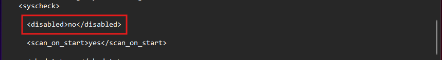

- Add `<scan_on_start>yes</scan_on_start>` is a setting that forces the agent to immediately perform a full file system scan when the Wazuh agent service starts or restarts.
  
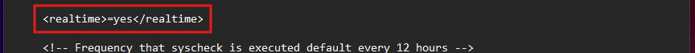

- By default Wazuh FID performs a syscheck every 12 hours which is 43200 seconds. I will change the `<frequency>43200</frequency>` setting to `<frequency>10</frequency>` so I can perform a test later.
  
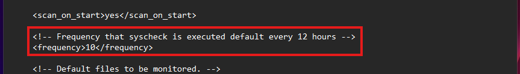

- The FIM module out-of-the-box already comes with predefined critical directories that it monitors. I will add my own with the following `<directories recursion_level="1" whodata="yes" report_changes="yes">C:\Users\Public</directories>` to monitor a file for attacker toolset uploads.
  
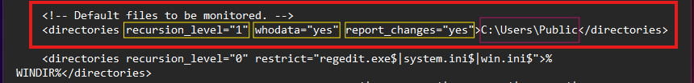

- Wazuh FIM uses the **`recursion_level`** attribute to define how deep into subdirectories or files the agent scans.
  
  💡 For this project I will go within my specified directory and 1-level deep subfolders `recursion_level="1"`

- One of my favorite capabilties of Wazuh FIM is the **`whodata`** attribute which is real-time capability that identifies not only **what** file was changed, but **who** and **what process** made the change.

- Finally is **`report_changes`**, is a feature that enables the detection and logging of the exact content modifications additions or deletions within text files.

  💡 Keep this file open for the nest steps
  
### 🎯 Next, I want to monitor and detect registry persistence or modifications.

---
### 6️⃣ Monitor Registry Paths 
Find the `Windows registry entries to monitor` so we can add our custom alert:
```bash
    <windows_registry>HKEY_CURRENT_USER\Software\Microsoft\Windows\CurrentVersion\Run</windows_registry>
    <windows_registry>HKEY_CURRENT_USER\Software\Microsoft\Windows\CurrentVersion\RunOnce</windows_registry>
    <windows_registry>HKEY_LOCAL_MACHINE\Software\Microsoft\Windows\CurrentVersion\Run</windows_registry>
    <windows_registry>HKEY_LOCAL_MACHINE\Software\Microsoft\Windows\CurrentVersion\RunOnce</windows_registry>
```
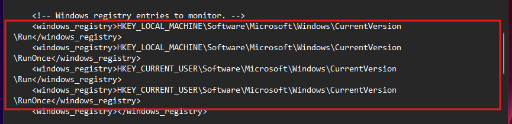

Restart the Wazuh agent:
```bash
Restart-Service Wazuh
```
---
### 7️⃣ Validate FIM is working
Create a file within the target directory `C:\Users\Public`:

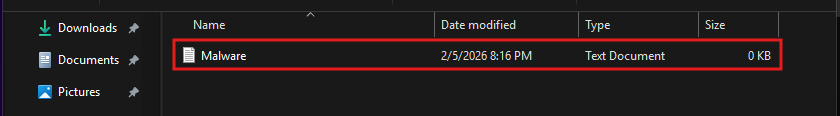 

I created malware.txt file in the `C:\Users\Public\Documents` directory with dummy data:

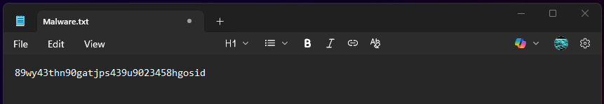 

---
### 8️⃣ View Windows FIM alert via Wazuh SIEM
If the configurations are working, we should be getting an alert in `FIM Security Events`:

FIM was **alerted** of a file that was **`added`** in our target directory:

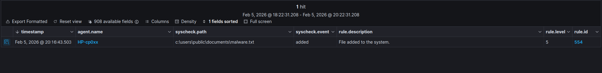 

FIM was **alerted** of a file that was **`modifed`** in our target directory:

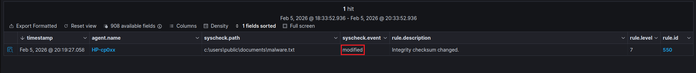 

FIM was **alerted** of a file that was **`deleted`** in our target directory:

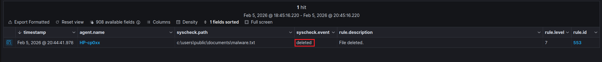 

This extended document details shows us exactly **`what`** file was changed, **`who`** did it, and **`what process`** made the change.

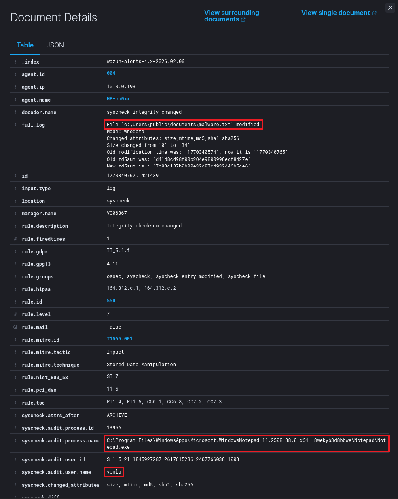 

✅This confirms that alert configuration and SIEM alerts are working for the target directory.

---
### 9️⃣ Testing for Registry Persistence
I will use a **`service-based`** persistence:
```bash
New-Item `
  "HKLM:\SYSTEM\CurrentControlSet\Services\EvilService"
```
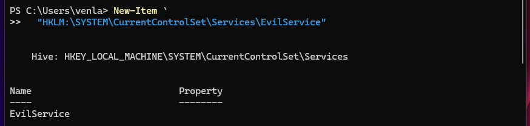 

Let's check the Wazuh SIEM Dashboard for alerts:

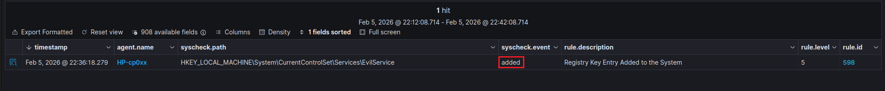 

✅This confirms that alert configuration and SIEM alerts are working for the target registry path.

---
## 🛠 Tools Used

- GitHub
- Powershell
- Wazuh SIEM
- Wazuh Agent (Windows)
- Wazuh Web Interface (Dashboard)
- Windows Registry
  
---


